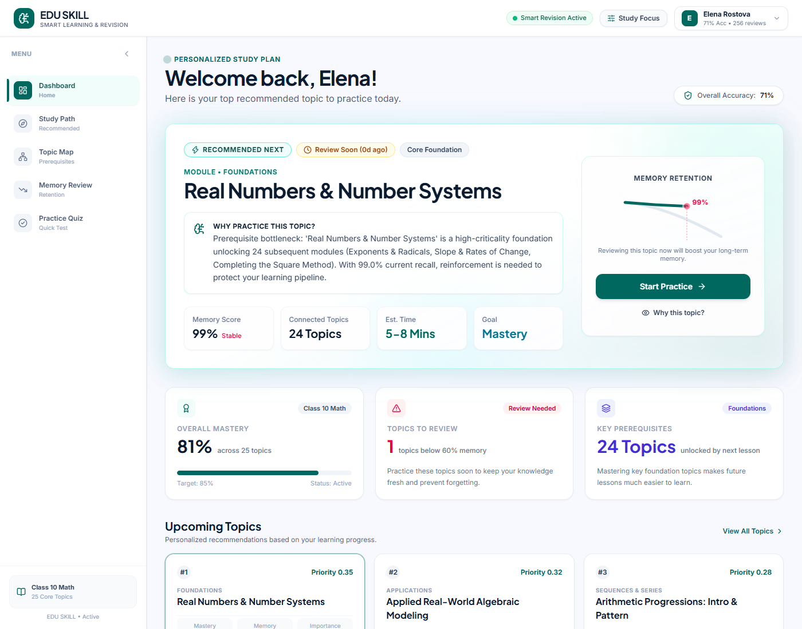
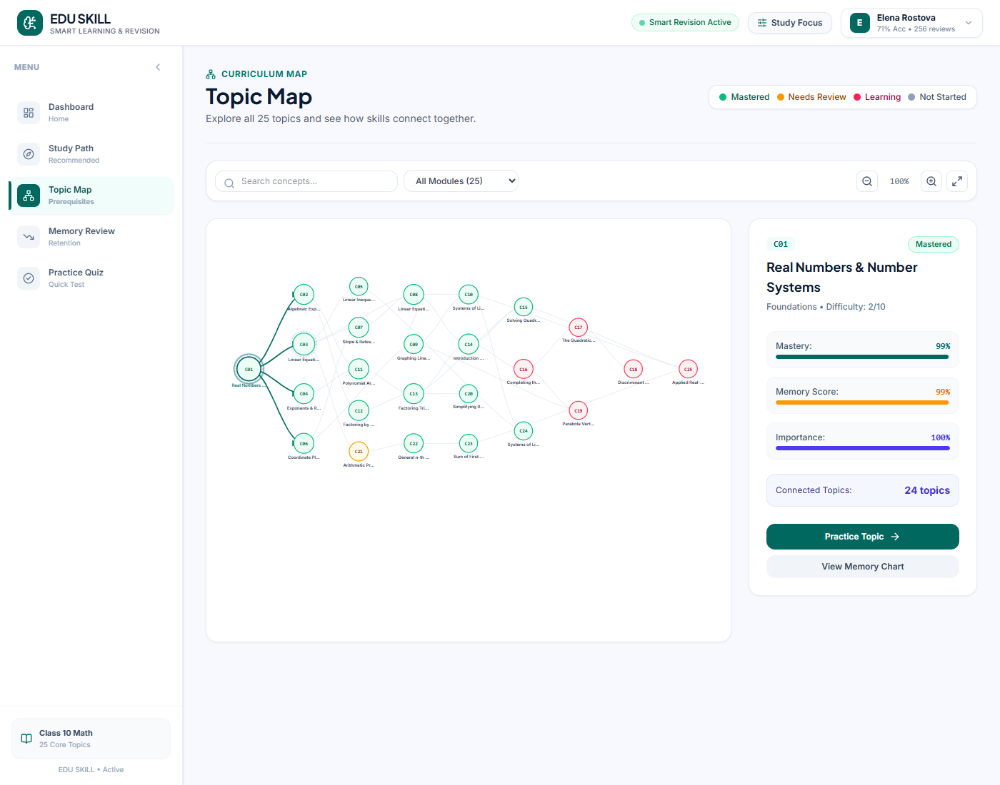
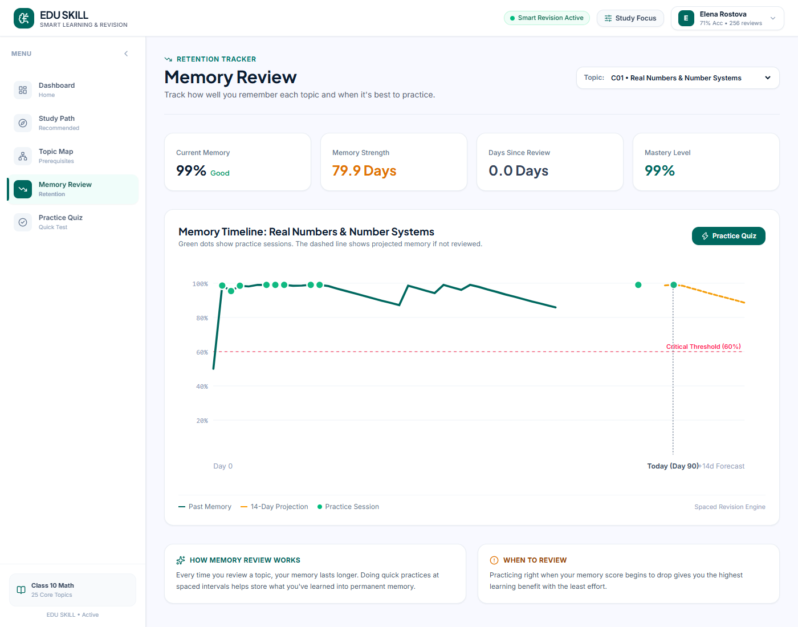

# EDU SKILL — Smart Learning & Revision

**EDU SKILL** is an intelligent, user-friendly learning and revision recommendation system designed for Class 10 Mathematics. It combines **Bayesian Knowledge Tracing (BKT)**, **Ebbinghaus Half-Life Memory Decay**, and a **Curriculum Prerequisite Graph** to deliver hyper-personalized study recommendations and real-time knowledge tracking.

---

## Key Features

- **Personalized Study Path**: Dynamically scores and prioritizes topics based on:
  \text{Priority} = w_1 \cdot \text{Skill Gap} + w_2 \cdot \text{Memory Need} + w_3 \cdot \text{Topic Importance}
- **Interactive Topic Map**: Visual dependency graph mapping 25 core curriculum topics and showing prerequisite bottlenecks.
- **Memory Retention Tracker**: Forecasts memory strength and provides spaced review alerts to prevent forgetting.
- **Practice Quiz with Instant Feedback Loop**: Live testing interface that immediately recalibrates topic mastery, memory decay, and next recommendations upon answering.
- **Custom Study Focus**: Configurable weights for learners who want to focus more on foundation topics, skill gaps, or memory review.

---

## App Previews

| Dashboard | Study Path |
| :---: | :---: |
|  |  |

| Topic Map | Memory Retention |
| :---: | :---: |
|  |  |

---

## Tech Stack

- **Backend**: Python 3.11+, FastAPI, SQLite, Pydantic, Scikit-learn, NetworkX, Pandas, NumPy.
- **Frontend**: React 19, TypeScript, Vite, Tailwind CSS v4, Lucide Icons, Framer Motion.
- **Deployment**: Docker (multi-stage), Docker Compose, Render / Vercel ready.

---

## Quickstart (Local Development)

### 1. Backend Setup
`ash
cd backend
python -m venv venv
# Windows:
.\venv\Scripts\activate
# Linux / macOS:
source venv/bin/activate

pip install -r requirements.txt
python -m uvicorn app.main:app --port 8000 --reload
`
API runs at http://localhost:8000 (Swagger docs at http://localhost:8000/docs).

### 2. Frontend Setup
`ash
cd frontend
npm install
npm run dev
`
Open http://localhost:5173 in your browser.

---

## Docker 1-Click Run

Run both frontend and backend in a unified production container:
`ash
docker compose up --build
`
Access the application at http://localhost:8000.

---

## Production Deployment

For complete instructions on deploying to **Render**, **Railway**, **Vercel**, **AWS/GCP**, or an **Ubuntu VPS**, see [DEPLOYMENT.md](DEPLOYMENT.md).

---

## Testing

Run backend tests:
`ash
cd backend
python -m pytest tests/
`
Run end-to-end browser capture & verification:
`ash
node capture_all_screens.mjs
`

---

## License
MIT
